# Compression report

Mode: recount_and_verify. Source: webcode2m.

Input pages: 100. Validated: 99. Excluded: 1.
Actually shorter validated targets: 96; shorter AND pixel-identical: 96.
Corpus token reduction, all known inputs: **30.49%** (0 unknown denominators).
Corpus token reduction, validated pairs: **30.71%**.
Page-average reduction, all known inputs: 27.88%.

Confidence intervals and full counts are in summary.json; source rows are in per_page.csv.

## Interpretation

- Headline cohort is ALL rows of Step 08, not only pages whose compression succeeded.
- Failed/unstable pages receive zero saving for corpus accounting only; they are not training examples.
- Original fallbacks can be pixel-identical without any compression; both rates are reported separately.
- Cumulative stage curve is the best available stage-accepted target at each level, before final revalidation. It is not an independently revalidated L1/L2 ablation or a causal contribution waterfall.
- Source category counts allocate each whole-document token to its source-span midpoint; totals add exactly, but categories are lexical and not causal. A text node need not be visible; CSS/script whitespace remains inside CSS/script categories.
- Sequence accounting is an ESTIMATE from render dimensions and the documented resize rule; it excludes prompt/chat/padding tokens. Report the HTML figure and the sequence figure together, never the HTML figure alone as a compute claim.
- L2 operator token deltas are separate counterfactuals; they need not add to total L2 savings and include serialization interactions.
- L3 buckets: characters removed in stage-accepted candidates, not token counts or an attribution to the final dataset.
- CSS census contains proposed opportunity on its recorded base, not realized final savings; individual token deltas are not additive.

## Figures

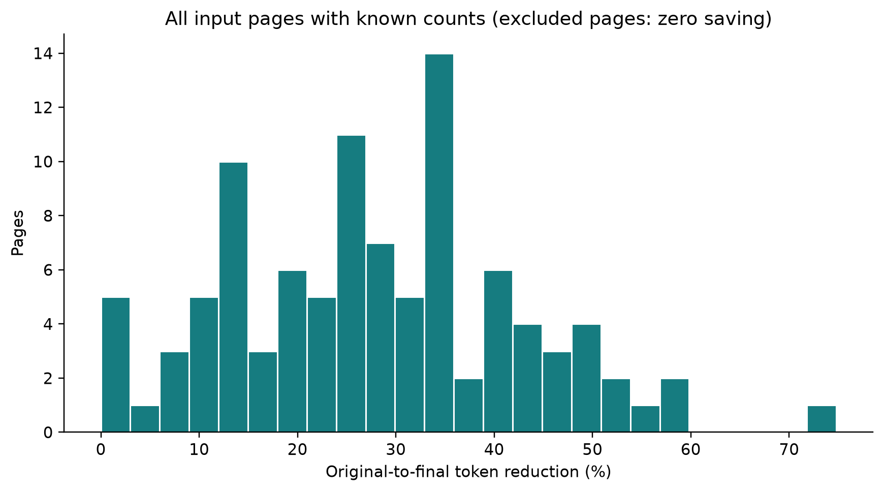

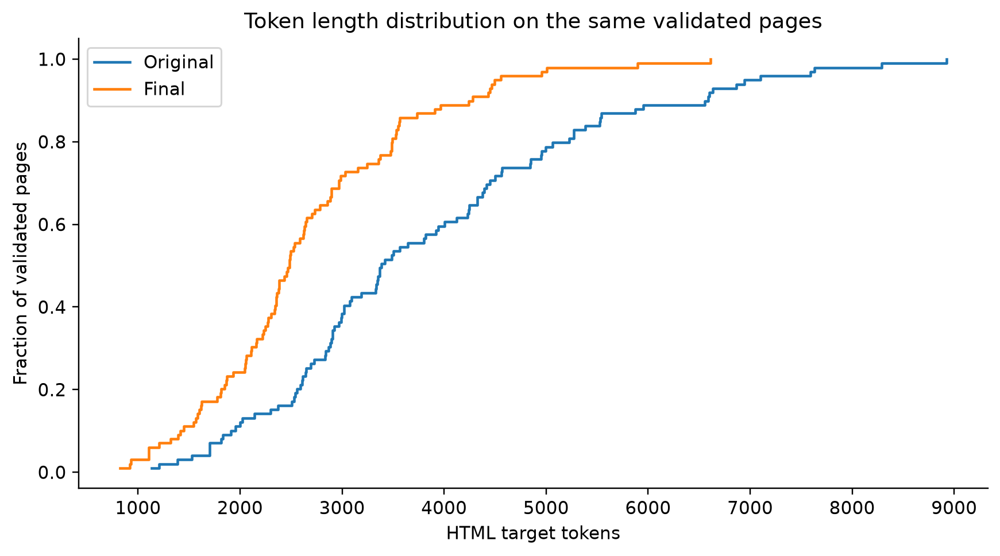

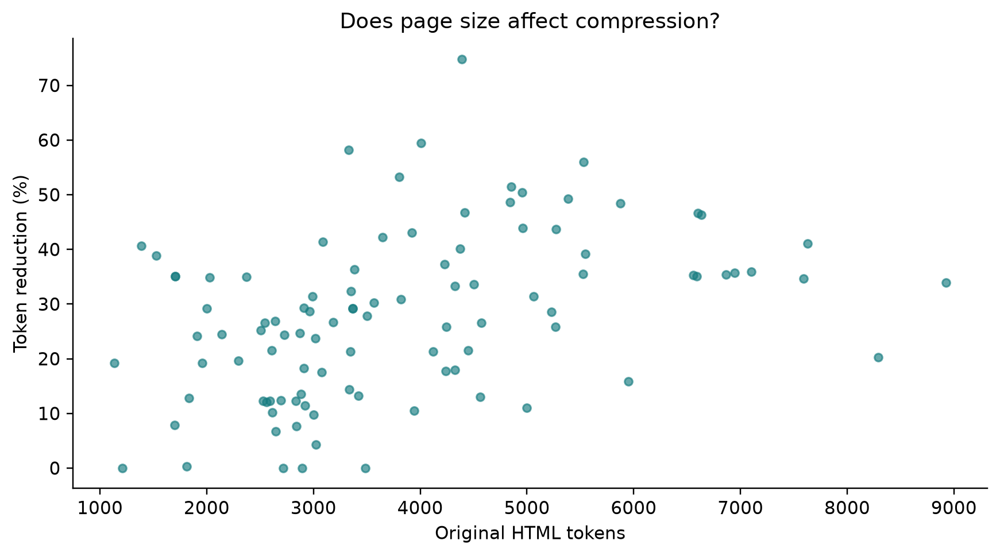

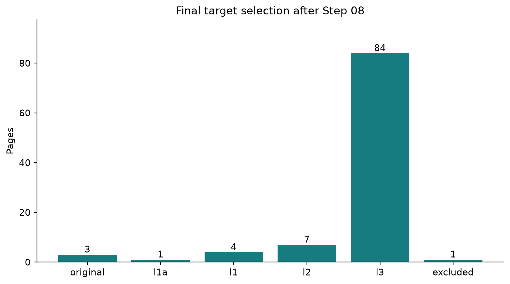

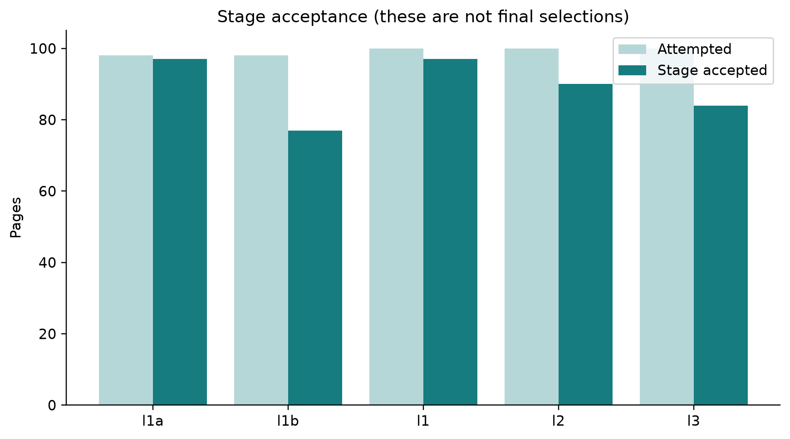

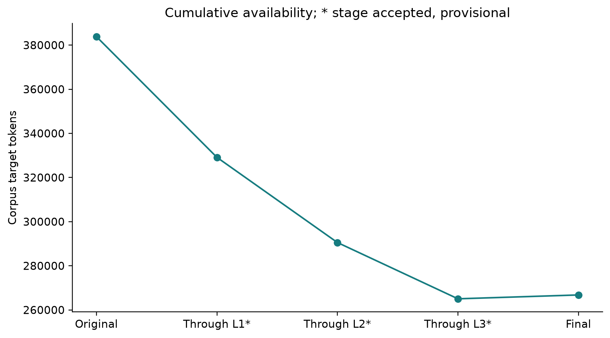

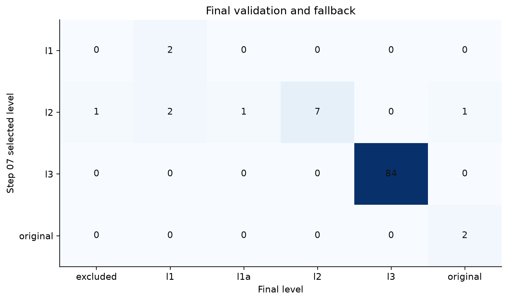

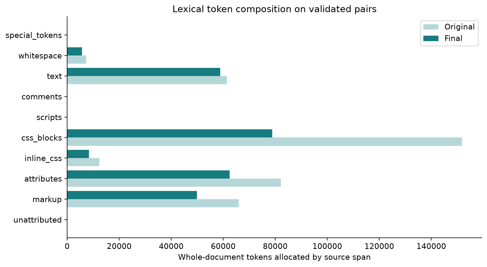

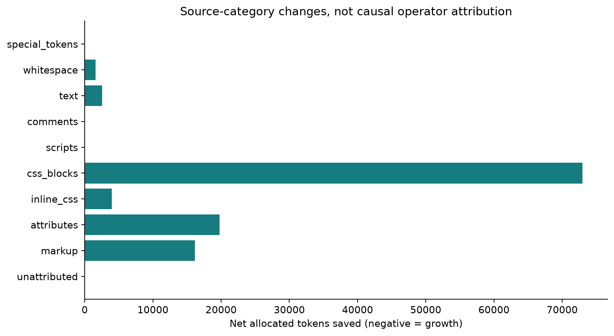

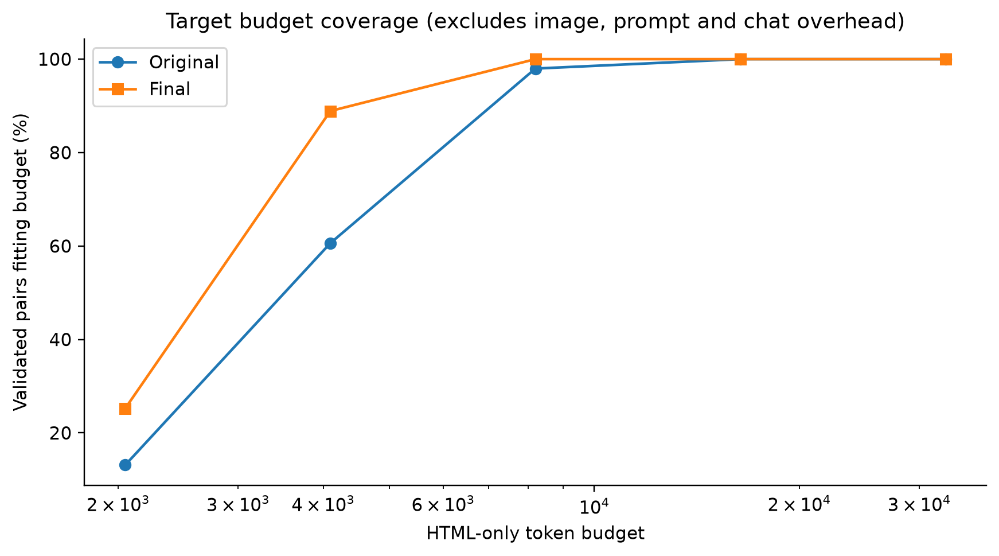

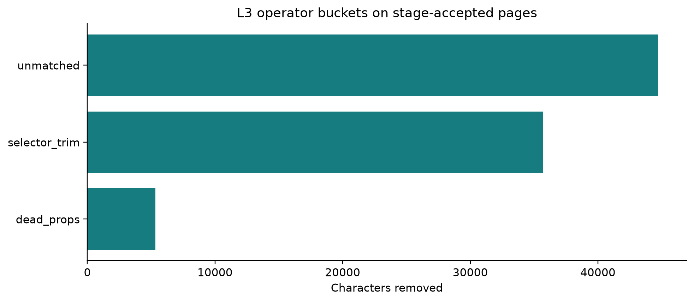

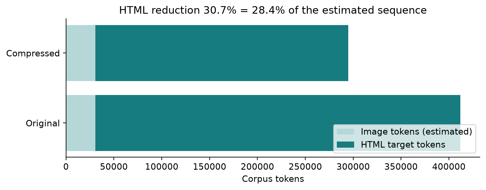
